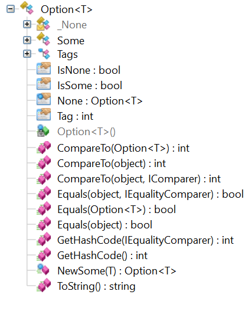

class: bold

Stronger Type Safety in F#
--------------------------

### Saul Rennison (RQF)

---

# Agenda

1. Introduction
1. Type safety in F#
1. Existential types
1. Generalised ADTs
1. Annulus of power

???

- don't sound like a zealot!
- the things f# gives us to help with type saftey
    - no nulls, options
    - single-case DUs / tiny-types
    - DU - can be done in OO but here is v easy (first class visitor pattern)
- the things we've built on this
    - GADTs - see Remco's noddy example - parser
    - existentials - from first principles
    - HLists
    - 'anulus of power'
        - input: unsafe - command args &c
        - inner: super-safe bit
        - need power to bridge this gap - existentials &c

---

# Hello!

Hi, I'm Saul

Joined G-Research as a grad in Sept 2016

Previously an intern in RQRD (now RQS & RQF) for 3 months in 2015

---

# What I am not

An expert in functional programming

Here to be a zealot

Speaking from an ivory tower

---

# Introduction

Whirlwind tour of how F# enables stronger type safety compared to other languages.

Some of the concepts have been talked about more thoroughly already.

Others have only been touched upon and I'll expand on.

.important[
    Key takeaways will be starred and highlighted like this.
]

**Let's go!**

---

class: bold

# `NullReferenceException: Object reference not set to an instance of an object`

???

So, what's the problem? 

---

# Billion Dollar Mistake

Famous quote from the inventor of the _null_ reference himself:

> I call it my billion-dollar mistake. It was the invention of the null reference in 1965. [...] My goal was to ensure that **all use of references should be absolutely safe**, with checking performed automatically by the compiler. But I couldn't resist the temptation to put in a null reference, simply because it was so easy to implement.
>
> -- <cite>Tony Hoare<cite>

---

# Billion Dollar Mistake

`null` is a value used to represent the lack of a value. This is the problem.

--

1. subverts types .muted[(can be used for any reference type)]
1. is a special case .muted[(has to checked for everywhere)]
1. makes poor APIs .muted[(e.g. `String.IsNullOrEmpty`)]
1. difficult to debug .muted[(how did this become null?)]
1. plus many, many more

--

When your type system (e.g. Java, or C#) allows `null` everywhere, you cannot exclude the possibility of `null`.

It's inevitable it will wind up conflated somewhere.

--

**We can do better!** 💪

---

name: nulls-in-fsharp

# Nulls in F#

Definition of a simple *record* type in F#:

```f#
type MyLittleType =
    {
        Foo : string
        Bar : int
    }
```

---

template: nulls-in-fsharp

The above is similar to this C# (and essentially compiles down to):

```c#
public class MyLittleType // Equatable, Comparable, etc.
{
    public MyLittleType(string foo, int bar)
    {
        this.Foo = foo;
        this.Bar = bar;
    }

    public readonly string Foo { get; }
    public readonly int Bar { get; }
}
```

---

template: nulls-in-fsharp

<hr>

```f#
let baz = { Foo = "Hello world"; Bar = 5 }
```

.success[OK!]

--

<hr>

```f#
let baz : MyLittleType = null
```

--

.error[
    `error FS0043: The type 'MyLittleType' does not have 'null' as a proper value`
]

---

class: bold

# So how do you represent `null`?

---

# Why do we need `null`?

`null` in OO languages represents the lack of an instance.

**So why don't we encode that in the type system?**

---

# Discriminated union types

aka _union_ types.

```f#
type Option<'T> =
    | None
    | Some of value: 'T
```

`Option<'T>` is part of the F# core library and represents a missing value, or a value.

.important[
Seeing `null` anywhere in F# is a huge code smell. 💩
]

---

# Discriminated union types

aka _union_ types.

```f#
type Option<'T> =
    | None                  // parameterless case
    | Some of value: 'T     // case with a single generic parameter
```

---

# Using union types

```f#
let nothing = None  // This can satisfy any 'T in Option<'T>
val nothing : Option<'T>

let answer = Some 42
val answer : Option<int>
```
--
<hr>

Pulling values out of cases:

```f#
match answer with
| None ->
    printfn "There is no answer :("
| Some underlyingInt -> // Pattern is `Some underlyingInt`
    printfn "Answer to everything: %d" underlyingInt
    // ==> Answer to everything: 42
```

This is called _pattern matching_.

Can also pattern match on strings, integers, records, lists, arrays - very powerful.

---

# Exhaustive pattern matching

```f#
let checkForEmpty (foo : Option<int>) =
    match foo with
    | None -> printfn "Nothing here"
```

--

.error[
    `warning FS0025: Incomplete pattern matches on this expression. For example, the value 'Some (_)' may indicate a case not covered by the pattern(s).`
]

(Only a warning, but we all have Warnings As Errors 😉)

.important[
Every case must be handled.
]

---

class: bold

# We've hit Tony Hoare's goal! 🎉

> My goal was to ensure that all use of references should be absolutely safe, with **checking performed automatically by the compiler**.

---

# 

TODO: None compiles down to null!

---

# Union types in C#

F# and C# compile down to IL which has the same type system.



TODO: It's possible to model F# union types in C# as a _visitor pattern_.

---

# Sum types vs. union types

Examples of sum types in languages:

- Structs, classes

Examples of union types:

- Enums, unions in C/C++

TODO do we need this?

---

# Nullability in other languages

- C# is moving towards 'non-nullable by default' in C# 8.0:
    ```c#
    class Person
    {
        public string FirstName;   // Not null
        public string? MiddleName; // May be null
        public string LastName;    // Not null
    }
    ```

- TypeScript has first-class support for union types.
    ```ts
    function length(s: string|null): int|null { /*...*/ }
    ```

- Many other languages have first-class support for unions.

---

# (Mis-)using built-in types

Built-in types, like ints and strings, are often used to represent values that must fit some constraints. The presence of these constraints is not apparent from the type system.

For example:

```c#
public bool SendEmail(string from, string to, string body) { /* ... */ }
```

`string` can represent an arbitrary sized sequence of UTF-16 code points.

**There are definitely some strings which are not valid email addresses.** The example above is _stringly typed_.

---

# Single-case discriminated unions

A solution to the _stringly typed_ problem is to use _tiny types_ (aka single-case discriminated unions).

```f#
type EmailAddress = private EmailAddress of string
```

This is another instance of a union type introduced earlier, but with just a **single case**.

--

```f#
module EmailAddress =
    let tryParse (email : string) =
        // Yes, I know this is wrong
        if Regex.IsMatch(email, @"[a-z]+@[a-z]+.[a-z]+") then
            Some (EmailAddress email)
        else
            None
```

The `private` in the tiny type definition is optional. However, it gives us a **guarantee** that any `EmailAddress` we see in our code has been validated, as there is just a single public constructor (`EmailAddress.tryParse`).

---

# Single-case discriminated unions

```f#
type EmailAddress = private EmailAddress of string
```

```f#
let myEmail = EmailAddress.tryParse "saul.rennison@gresearch.co.uk"
match myEmail with
| None -> printfn "Could not parse"
| Some email ->
    let emailParts = email.Split '@'
    // ...
```

--

.error[
    `error FS0039: The field, constructor or member 'Split' is not defined.`
]

We can't implicitly access the underlying string.

The only methods/functions available for `EmailAddress` are ones we write.

---

# Single-case discriminated unions

```f#
type EmailAddress = private EmailAddress of string
```

Forces you to put your domain logic in one place:

```f#
module EmailAddress =
    let tryParse (email : string) = // ...
    let localPart (EmailAddress email) =
        email.Split('@').[0]
```

.important[
    - Value is validated at construction.
]

--

TomD did a great talk on domain modelling last Thursday.

---

# Single-case discriminated unions

```c#
public bool SendEmail(string from, string to, string body) { /* ... */ }
```

Can now be re-written as:

```f#
let sendEmail (from: EmailAddress) (to: EmailAddress) (body: string) : bool
```

